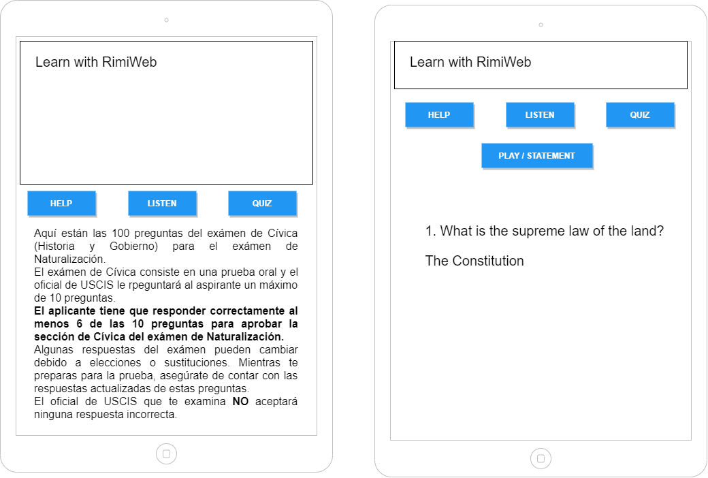

# Citizenship Help

## Requirements

Client wants an app that allows them to be trained in the 100 questions for citizenship test, using both audio and reading capabilities. They will also want to have quizing options.

## MVP Description

Web application with an interface for interacting with questions, answers and audio in an intuitive way to achieve a streamlined learning experience.

